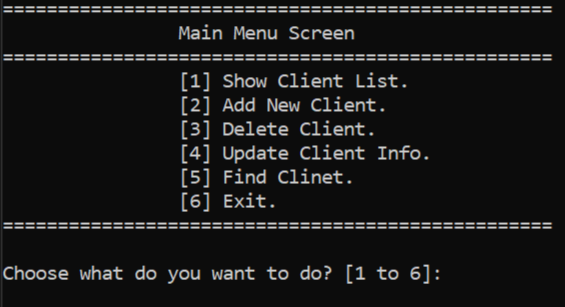
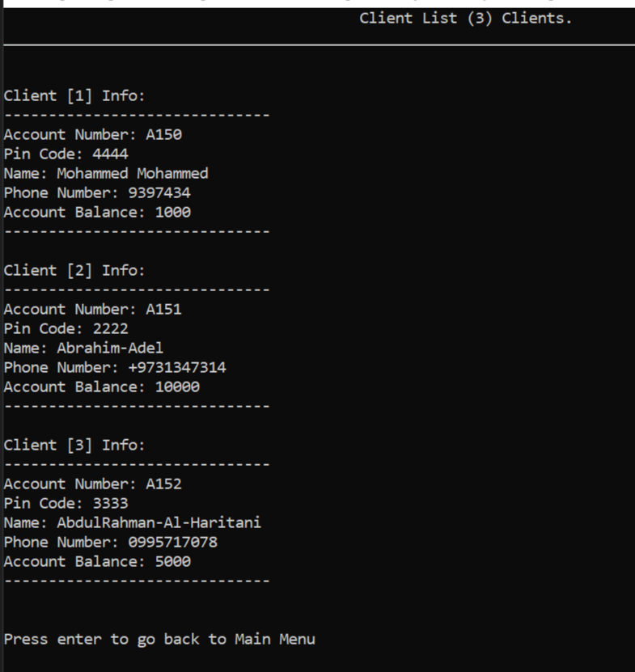
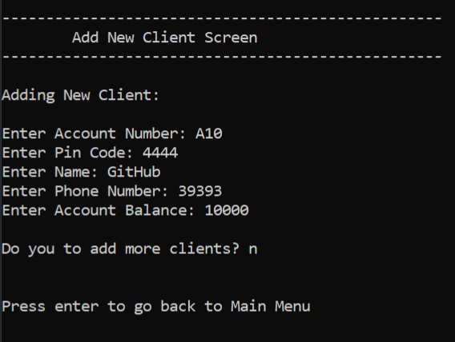
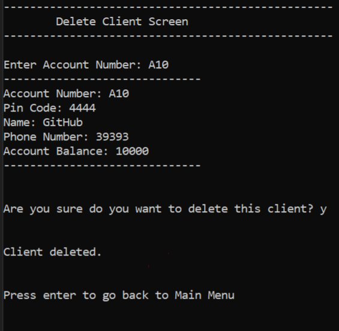
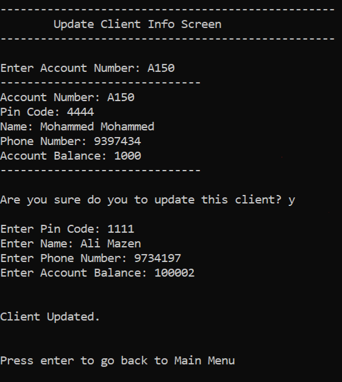
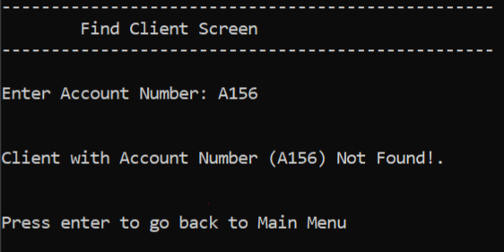
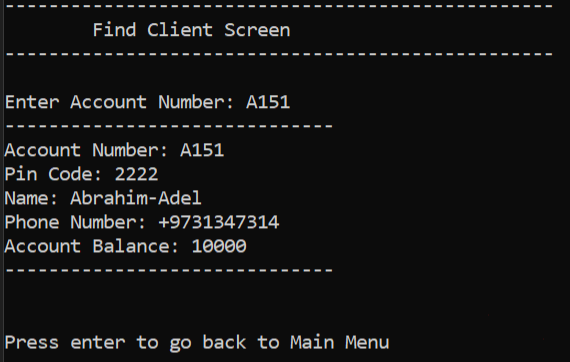
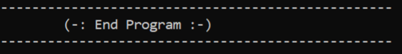

# 🏦 Bank System Management

A simple yet powerful **C++ console application** for managing bank clients.  
This system allows you to perform full **CRUD operations** (Create, Read, Update, Delete) on client records, with data persistence using text files.

---

## ✨ Features

- ➕ **Add New Client** – with unique account number validation.
- 📋 **Display All Clients** – view all clients in a clean, tabular format.
- 🔍 **Search Client** – find a client by their account number.
- ✏️ **Update Client Info** – modify client details (PIN, Name, Phone, Balance).
- 🗑️ **Delete Client** – safely remove a client from the system.
- 💾 **File Storage** – data is saved to and loaded from `Clients.txt`.
- 🧹 **Clean Code** – organized into functions, with input validation.

---

## 🛠️ Technologies Used

- **Language:** C++
- **Libraries:** `iostream`, `fstream`, `vector`, `string`, `cctype`, `limits`
- **Storage:** Text File (`.txt`)

---

## 🚀 How to Run

### 1. Clone the Repository
```bash
git clone https://github.com/abdulrahamanharitani-ai/Project-1-Bank-System-Management.git

## 📁 File Structure
Project-1-Bank-System-Management/
├── Project 1 Bank System Management.cpp # Main source code
├── Project 1 Bank System Management.sln # Visual Studio solution
├── Clients.txt # Data file (auto-generated)
├── .gitattributes
├── .gitignore
└── README.md # This file

---

## 📸 Screenshots

### Main Menu


### Client List


### Add New Client


### Delete Client


### Update Client


### Find Client (Not Found)


### Find Client (Found)


### End Program


---

## 👤 Author

**Abdulrahman Al-Haritani**  
- GitHub: [abdulrahamanharitani-ai](https://github.com/abdulrahamanharitani-ai)

---

## 📄 License

This project is for **educational purposes** only.  
You are free to use, modify, and distribute it for learning.
